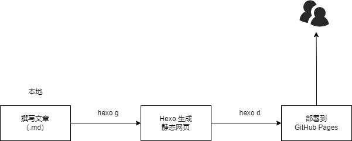

<!-- toc -->

# 前言

​		使用 GitHub Pages 搭建 Hexo 静态博客网站，特点就在于完全免费使用。虽然搭建时比较麻烦，但配置完成后，基本不需要操心维护的事。

# 介绍

## GitHub Pages

​		GitHub Pages 是由 GitHub 官方提供的一种免费的静态站点托管服务，可以在 GitHub 仓库里托管和发布自己的静态网站页面。

- [About GitHub Pages - GitHub Docs](https://docs.github.com/en/pages/getting-started-with-github-pages/about-github-pages)

## Hexo

​		Hexo 是一个快速、简洁且高效的静态博客框架，基于 Node.js 运行，可以将 Markdown 文档解析渲染成静态的 HTML 网页。

- [Hexo](https://hexo.io/zh-cn/)

## Hexo+GitHub 文章发布原理

​		在本地撰写 Markdown 格式文章后，通过 Hexo 解析文档，渲染生成具有主题样式的 HTML 静态网页，再推送到 GitHub 上完成博文的发布



## 优点和不足

- **优点**：完全免费；静态站点，轻量快速；可按需求自由定制改造；托管在 GitHub，安全省心；迁移方便等
- **不足**：发文不便，依赖于本地环境；更适合个人博客使用；GitHub 在国内访问速度慢

# 搭建步骤

## 环境准备

### 工具

​		Hexo 基于 Node.js，搭建过程中还需要使用 npm 和 git

- [Node.js](https://nodejs.org/zh-cn)

- [Git](https://git-scm.com/downloads)

    分别执行下述命令检验是否安装成功

```shell
node -v

npm -v

git --version
```

### GitHub 注册

1. 使用邮箱注册 [GitHub](https://github.com/) 账户：选择免费账户（Free），并完成邮件验证
2. 在自己的机器上打开 `Git Bash`，设置用户名和邮箱

   ```shell
   git config --global user.name "GitHub 用户名"
   git config --global user.email "GitHub 邮箱"
   ```

## 配置 GitHub 密钥连接

### 本机创建密钥

​		终端输入以下命令生成密钥

```shell
ssh-keygen -t rsa -C "GitHub 邮箱"
```

回车后第一个选项可以设置密钥文件的名称，后续设置一直回车即可。

### GitHub 中添加密钥

1. 登录 GitHub
2. 点击头像 ->  下拉列表选择 `Settings` ->  左侧导航栏选择 `SSH and GPG keys` -> 右上角选择 `New SSH Key`
3. 编辑 `Title` -> `Key type` 默认 `Authentication Key` 即可 -> 将上一步生成的密钥的公钥文件（即带 `_pub` 后缀的文件）中的内容复制到 `Key` 栏中
4. 点击 `Add SSH key` 保存设置
5. 本机终端上使用下面命令验证 GitHub 密钥连接是否配置成功

   ```shell
   ssh -T git@github.com
   ```

   如果出现下述信息即表明配置成功

   ```
   Hi <GitHub 用户名>! You've successfully authenticated, but GitHub does not provide shell access.
   ```

## 创建 GitHub Pages 仓库

1. 在 GitHub 主页的左侧点积按钮 `New` 创建仓库
2. 仓库名称建议为 `用户名.github.io`；并设置为公开仓库；
3. 创建后默认自动启用 HTTPS，博客地址为 `https://用户名.github.io`

## 本地安装 Hexo 博客程序

1. **安装 Hexo**：使用 npm 一键安装 Hexo 博客程序

   ```shell
   npm install -g hexo-cli
   ```
2. **Hexo 初始化并安装所需组件**：建目录并进入，然后执行以下命令

   ```shell
   hexo init  # 初始化
   npm install  # 安装组件
   ```
3. **启动本地服务进行预览**

   ```shell
   hexo g  # 生成页面
   hexo s  # 启动预览
   ```

   访问 `http://localhost:4000`，出现 Hexo 默认页面，表明本地博客安装成功

   如果端口被占用，可以使用 `hexo server -p 5000` 指定端口

### Hexo 博客文件夹目录结构

```
.
|-- _config.yml    # 网站配置信息
|-- package.json   # 应用程序信息
|-- scaffolds      # 模板文件夹
|-- source         # 存放用户资源，Markdown 文档
|   |-- _drafts
|-- |-- _posts
|-- themes         # 主题文件夹
|-- public 		   # 网站文件
```

## 部署 Hexo 到 GitHub Pages

1. 在本地 Hexo 工作目录中安装插件

   ```shell
   npm install hexo-deployer-git --save
   ```
2. 修改 `_config.yml` 的 `deploy` 配置部分

   ```yml
   deploy:
       type: git
       repository: git@github.com:用户名/用户名.github.io.git
       branch: main
   ```
3. 执行下述命令将网站上传部署到 GitHub Pages

   ```shell
   hexo d
   ```

   此时，访问 `https://用户名.github.io` 就可以访问到 Hexo 网站了

## 绑定域名（可选）（未验证）

    博客搭建完成使用的是 GitHub 的子域名（`用户名.github.io`），可以为 Hexo 博客绑定自己的域名替换 GitHub 域名，更加个性化和专业，也利于 SEO。
    
    可以使用[Namesilo](https://www.namesilo.com/?rid=d27fa32do) 进行注册

### 域名注册和解析

- 域名注册和解析教程：[Namesilo 域名购买及使用教程](https://zhuanlan.zhihu.com/p/33921436)

    按照教程注册并解析域名，在 DNS 设置部分，删除自带的记录，然后添加 CNAME 记录将`www` 域名解析指向 `用户名.github.io`

### 绑定域名到 Hexo 博客

    进入本地博客文件夹的 source 目录，打开记事本，输入自己的域名，如`http://www.example.com`，保存名称为 `CNAME` （无后缀）的文件。
    
    清除缓存等文件并重新发布网站

```shell
hexo clean    # 清除缓存文件等
hexo g      
hexo s    
```

### 开启 HTTPS

    配置自己的域名后，需要手动开启 HTTPS。打开博客所在的 GitHub 仓库 -> 选择`Settings` -> 下拉找到 `GitHub Pages` -> 勾选 `Enforce HTTPS`。
    
    HTTPS 证书部署成功需要一定时间，等大概几分钟再访问域名，就可以看到域名前面的小绿锁了，HTTPS 配置完成。

# 开始使用

## 发布文章

    进入博客所在目录，在终端中执行下面命令以创建博文

```shell
hexo new "title"
```

然后 source 文件夹中会出现一个 `title.md` 文件，然后编辑改文件即可。编辑完成后执行下面的命令进行发布

```shell
hexo g
hexo d

# 上述命令可以简化为一条
hexo g -d
```

    也可以手动创建 Markdown 文件，只需要在文件开头手动加入`Front-matter` （该格式模板可自己设置）

```markdown
---
title: 如何使用Hexo和GitHub搭建静态博客
date: 2024-05-02 16:41:41
tags:
categories: 
---
```

## 网站设置

​		包括网站名称、描述、作者、链接样式等，全部在网站目录下的 `_config.yml` 文件中，参考 [官方文档](https://hexo.io/zh-cn/docs/configuration)

## 更换主题

​		在 [Themes|Hexo](https://hexo.io/themes/) 选择一个喜欢的主题 -> 进入到themes目录下克隆对应的项目 -> 修改 `_config.yml` 中的 themes 为新注意的名称，然后发布即可

## 常用命令

```shell
hexo new "name"       # 新建文章
hexo new page "name"  # 新建页面
hexo g                # 生成页面
hexo d                # 部署
hexo g -d             # 生成页面并部署
hexo s                # 本地预览
hexo clean            # 清除缓存和已生成的静态文件
hexo help             # 帮助
```

## Hexo 插件

### 文章生成目录

> 参考：[Hexo 为文章添加目录](https://cloud.tencent.com/developer/article/2065866)

1. **安装插件**

   ```shell
   npm install hexo-toc --save
   ```

2. 编写配置 `_config.yml`

   ```yml
   toc:
     maxdepth: 3
   ```

3. **添加配置**：在需要展示目录的地方添加

   ```markdown
   <!-- toc -->
   ```

   

# 常见问题

- **Hexo 设置显示文章摘要，首页不显示全文**：可以在文章中插入 `<!-- more -->` 进行分段。该代码前面的内容会作为摘要显示，而后面的内容会替换为 `Read More` 隐藏起来。

- **设置网站图标**：进入 `themes/主题` 文件夹，打开 `_config.yml` 配置文件，找到 favicon 修改，一般格式为 `favicon: 图标地址` （不同主题可能略有差别）

- **修改并部署后没有效果**：使用 `hexo clean` 清理后重新部署

- **开启 HTTPS 后访问网站显示连接不安全**：证书还未部署生效，等待一会儿，清除浏览器缓存再试

- **Mac 安装 Hexo 报错无法安装**：Mac 用户需要管理权限运行，使用下述命令安装

  ```shell
  sudo npm install -g hexo-cli
  ```

- **npm 下载速度慢，甚至完全没反应**：更换为国内镜像源

  ```shell
  npm config set registry "国内镜像源地址"
  ```

  具体地址可在网上查询

# 参考

- 使用 Hexo+GitHub 搭建个人免费博客教程：https://zhuanlan.zhihu.com/p/60578464
